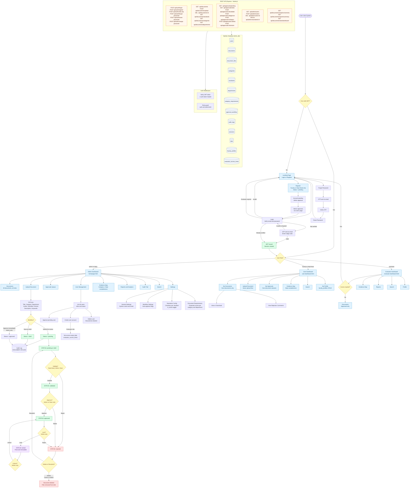

# DRMS-QA System Flowchart

```mermaid
flowchart TD

    START([User visits System]) --> AUTH{Has valid JWT?}
    AUTH -- No --> LANDING[Landing Page\nLogin or Register]
    AUTH -- Yes --> ROLE_REDIRECT

    LANDING --> REG[Register\nFaculty or Dept-Head only\nStatus = pending]
    LANDING --> LOGIN[Login\nVerify email and password]
    LANDING --> FP[Forgot Password]

    REG --> WAIT[Account pending\nAdmin approval]
    WAIT --> ADMIN_APPROVE[Admin approves\nvia Users page]
    ADMIN_APPROVE --> LOGIN

    LOGIN -- Invalid --> LANDING
    LOGIN -- Evaluator expired --> LANDING
    LOGIN -- Not verified --> OTP[OTP sent to email\nEnter 6-digit code]
    OTP -- Valid --> TOKEN[JWT issued\nSession created]
    OTP -- Invalid or Expired --> LOGIN
    LOGIN -- Already verified --> TOKEN
    TOKEN --> ROLE_REDIRECT

    FP --> FP_OTP[OTP sent to email]
    FP_OTP --> FP_VERIFY[Verify OTP]
    FP_VERIFY --> FP_RESET[Reset Password]
    FP_RESET --> LANDING

    ROLE_REDIRECT{User Role?}
    ROLE_REDIRECT -- admin or dean --> ADMIN_DASH[Admin Dashboard\nhomepage.html]
    ROLE_REDIRECT -- faculty or dept-head --> USER_DASH[User Dashboard\nuser-dashboard.html]
    ROLE_REDIRECT -- evaluator --> EVAL_DASH[Evaluator Dashboard\nevaluator-dashboard.html]

    ADMIN_DASH --> AD_DOCS[Documents\nAll documents, all roles]
    ADMIN_DASH --> AD_UPLOAD[Upload Document]
    ADMIN_DASH --> AD_APPROVALS[Approvals Queue]
    ADMIN_DASH --> AD_USERS[User Management]
    ADMIN_DASH --> AD_EVIDENCE[Evidence Map\nCategory x Dept completeness]
    ADMIN_DASH --> AD_REPORTS[Reports and Analytics]
    ADMIN_DASH --> AD_AUDIT[Audit Trail]
    ADMIN_DASH --> AD_SEARCH[Search]
    ADMIN_DASH --> AD_SETTINGS[Settings]

    AD_UPLOAD --> UPL_FORM[Fill Form\nTitle, Category, Department\nAuthor, Standard, Version\nDescription, Keywords]
    UPL_FORM --> UPL_WORKFLOW{Workflow?}
    UPL_WORKFLOW -- Submit for review --> S_PENDING[Status = pending]
    UPL_WORKFLOW -- Save as draft --> S_DRAFT[Status = draft]
    UPL_WORKFLOW -- Approve immediately\nAdmin only --> S_APPROVED_D[Status = approved]
    S_PENDING --> AUDITLOG[(Audit Log\nDOCUMENT UPLOAD)]
    S_DRAFT --> AUDITLOG
    S_APPROVED_D --> AUDITLOG

    S_PENDING --> WF_PENDING[STATUS: pending or draft]

    WF_PENDING --> WF_VALIDATE{Validate?\nDept-Head, Admin, Dean}
    WF_VALIDATE -- Validate --> WF_VALIDATED[STATUS: validated]
    WF_VALIDATE -- Reject --> WF_REJECTED[STATUS: rejected]

    WF_VALIDATED --> WF_APPROVE{Approve?\nAdmin or Dean only}
    WF_APPROVE -- Approve --> WF_APPROVED[STATUS: approved]
    WF_APPROVE -- Reject --> WF_REJECTED

    WF_APPROVED --> WF_LOCK{Lock?\nAdmin only}
    WF_LOCK -- Lock --> WF_LOCKED[STATUS: locked\nFinal and Immutable]
    WF_LOCK -- Reject --> WF_REJECTED

    WF_LOCKED --> WF_UNLOCK{Unlock?\nAdmin only}
    WF_UNLOCK -- Unlock --> WF_APPROVED

    WF_REJECTED --> WF_DELETE{Delete or Resubmit?}
    WF_DELETE -- Delete\nOwner or Admin --> REMOVED[Document deleted\nFiles removed from disk]
    WF_DELETE -- Resubmit --> WF_PENDING

    AD_USERS --> UM_LIST[List all users\nroles and status]
    UM_LIST --> UM_APPROVE[Approve pending user]
    UM_LIST --> UM_CREATE[Create user account]
    UM_LIST --> UM_DELETE[Delete user\nDocuments retained]
    UM_CREATE -- Evaluator role --> EVAL_EXPIRY[Set access expiry date\nevaluator_access_limits]

    AD_SETTINGS --> SET_GENERAL[General Settings\nSystem name and email]
    AD_SETTINGS --> SET_WORKFLOW[Workflow Settings\nAuto-approve flags]
    AD_SETTINGS --> SET_STANDARDS[Standards Config\nCheckbox per standard\nis_active toggle]
    AD_SETTINGS --> SET_REQS[Document Requirements\nExpected counts per\ncategory and department]

    USER_DASH --> UD_DOCS[My Documents\nOwn documents only]
    USER_DASH --> UD_UPLOAD[Upload Document\nSame upload flow]
    USER_DASH --> UD_APPROVALS[My Approvals\nOwn document statuses]
    USER_DASH --> UD_EVIDENCE[Evidence Map\nDept completeness]
    USER_DASH --> UD_SEARCH[Search]
    USER_DASH --> UD_PROFILE[My Profile\nfaculty_profiles CRUD]

    UD_DOCS --> UD_VIEW[View or Download]
    UD_DOCS --> UD_COMMENTS[View Rejection Comments]

    EVAL_DASH --> EV_CHECK{Access expired?}
    EV_CHECK -- Yes --> LANDING
    EV_CHECK -- No --> EV_DOCS[Documents\nApproved only]
    EVAL_DASH --> EV_EVIDENCE[Evidence Map]
    EVAL_DASH --> EV_REPORTS[Reports]
    EVAL_DASH --> EV_SEARCH[Search]
    EVAL_DASH --> EV_PROFILE[Profile]

    subgraph API ["REST API  (Express - Node.js)"]
        direction TB
        RT_AUTH["POST api/auth/login\nPOST api/auth/register\nPOST api/auth/verify-otp\nPOST api/auth/forgot-password\nPOST api/auth/reset-password\nPOST api/auth/change-password"]
        RT_DOCS["GET  api/documents\nPOST api/documents/upload\nDEL  api/documents/:id\nGET  api/documents/standards\nGET  api/documents/categories\nGET  api/documents/departments"]
        RT_APPROVALS["GET  api/approvals/pending\nGET  api/approvals/stats\nPOST api/approvals/:id/validate\nPOST api/approvals/:id/approve\nPOST api/approvals/:id/reject\nPOST api/approvals/:id/lock\nPOST api/approvals/:id/unlock"]
        RT_ADMIN["GET  api/admin/users\nPOST api/admin/users\nDEL  api/admin/users/:id\nPATCH api/admin/standards/:id"]
        RT_ANALYTICS["GET api/documents/analytics/overview\nGET api/documents/reports/summary\nGET api/documents/stats/dashboard"]
    end

    subgraph DB ["MySQL Database  (drms_db)"]
        direction LR
        T_USERS[(users)]
        T_DOCS[(documents)]
        T_FILES[(document_files)]
        T_CATS[(categories)]
        T_STDS[(standards)]
        T_DEPTS[(departments)]
        T_CATREQS[(category_requirements)]
        T_WORKFLOW[(approval_workflow)]
        T_AUDIT[(audit_logs)]
        T_SESSIONS[(sessions)]
        T_OTPS[(otps)]
        T_PROFILES[(faculty_profiles)]
        T_EVAL[(evaluator_access_limits)]
    end

    subgraph MW ["Auth Middleware"]
        JWT_CHECK[Verify JWT token\nx-auth-token header]
        ROLE_CHECK[Role guard\nauth and adminAuth]
    end

    API --> DB
    API --> MW

    classDef page fill:#e0f2fe,stroke:#0284c7,color:#0c4a6e
    classDef decision fill:#fef9c3,stroke:#ca8a04,color:#713f12
    classDef wfstate fill:#dcfce7,stroke:#16a34a,color:#14532d
    classDef rejected fill:#fee2e2,stroke:#dc2626,color:#7f1d1d
    classDef locked fill:#f3e8ff,stroke:#9333ea,color:#3b0764
    classDef db fill:#f1f5f9,stroke:#64748b,color:#1e293b
    classDef api fill:#fff7ed,stroke:#ea580c,color:#431407

    class LANDING,REG,ADMIN_DASH,AD_DOCS,AD_UPLOAD,AD_APPROVALS,AD_USERS,AD_EVIDENCE,AD_REPORTS,AD_AUDIT,AD_SEARCH,AD_SETTINGS,USER_DASH,UD_DOCS,UD_UPLOAD,UD_APPROVALS,UD_EVIDENCE,UD_SEARCH,UD_PROFILE,EVAL_DASH,EV_DOCS,EV_EVIDENCE,EV_REPORTS,EV_SEARCH,EV_PROFILE page
    class AUTH,ROLE_REDIRECT,UPL_WORKFLOW,WF_VALIDATE,WF_APPROVE,WF_LOCK,WF_UNLOCK,WF_DELETE,EV_CHECK decision
    class WF_PENDING,WF_VALIDATED,WF_APPROVED,S_PENDING,S_DRAFT,TOKEN wfstate
    class WF_REJECTED,REMOVED rejected
    class WF_LOCKED locked
    class T_USERS,T_DOCS,T_FILES,T_CATS,T_STDS,T_DEPTS,T_CATREQS,T_WORKFLOW,T_AUDIT,T_SESSIONS,T_OTPS,T_PROFILES,T_EVAL db
    class RT_AUTH,RT_DOCS,RT_APPROVALS,RT_ADMIN,RT_ANALYTICS api
```
